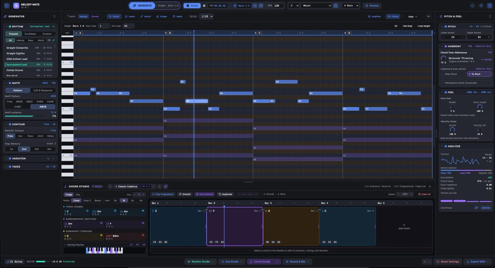

# Melody Mate v2

Melody Mate v2 is a generative MIDI workstation and melodic sketchpad designed for music producers, beatmakers and composers. It runs entirely in the browser and helps you create musically coherent melodies, basslines, arpeggios and chord progressions without relying on generic randomizers or cloud subscriptions.

Once you have an idea you like, you can edit it directly on an interactive canvas piano roll, audition it using the built-in synthesizer engine, stream live MIDI to your DAW or hardware synthesizer, and export clean multi-track MIDI directly into your DAW (Ableton Live, FL Studio, Logic Pro, Studio One, Cubase, Bitwig, or Reaper).

<!-- Screenshot Placeholder: Full workspace view with piano roll, sidebars and docks -->



## Why Melody Mate?

As a software engineer and hobby music producer, Melody Mate started as a personal passion project. Most generative MIDI tools fall into one of two extremes: either they are basic random-note generators that produce unmusical noise, or they are locked inside heavy subscription plugins.

I wanted to build a tool that I would genuinely use in my own studio sessions: something fun to use, musically grounded and inspiring. Melody Mate is built around practical music theory rules and classical compositional techniques. Instead of rolling random dice, it combines N-gram Markov models with voice leading heuristics, call-and-response structures and rhythmic foundations. It acts like a fast musical sparring partner that can spark ideas.

### Mathematical Algorithms, Not Black-Box AI

The term "AI" gets attached to almost everything these days, but Melody Mate does not use deep learning, neural networks, or cloud-based LLM prompts to generate music. Every note choice is driven by deterministic mathematics and rule-based voice leading heuristics. The generation is transparent, runs entirely locally in your browser and works completely offline.

### Thoughtfully Engineered (Not "Vibe Coded")

While Melody Mate was built with AI pair-programming assistance, it was not "vibe coded" into a fragile pile of unverified scripts. Drawing from over two decades of software engineering experience, the codebase is built on solid self-defined architectural principles: a pure TypeScript algorithmic core completely decoupled from UI frameworks, strict unidirectional state management with Zod schema validation and an extensive suite of over 1,600 automated tests verifying music theory logic, audio DSP pipelines and timing converters.

### An Instrument, Not a Magic Wand

Melody Mate cannot magically write your next radio hit with a single button press. Because everything is grounded in combinatorial mathematics, music theory rules and probability, not every setting combination will immediately sound perfect together. Some parameter pairings will sound unusual or quirky until you find the right balance of options. Experimentation is encouraged!

Treat Melody Mate as an interactive musical instrument: experiment with different scales, shape the contour, nudge sliders, audition variations in the Take Rack and let happy accidents guide your arrangement. The fun lies in exploring ideas, finding a spark and shaping it into an inspriration for your next track.

## Core Features

### Targeted Generation with Work Ranges

You do not have to regenerate an entire track just to fix one awkward measure. The Work Range system lets you highlight any section (such as Bar 2 to 3, or a specific 4-beat phrase) and apply generation, mutation, or transformation only to those steps. Notes outside the work range remain untouched.

### Interactive Canvas Piano Roll

- Built on a dedicated HTML5 2D canvas running at 60 FPS.
- Dual-track editing: toggle between Melody (Lead) and Harmony (Chords) via the toolbar or Tab key.
- Scale Lock (shortcut K) snaps live note drawing and dragging strictly to the active scale, preventing accidental off-scale notes.
- Scale highlighting illuminates valid scale degrees while darkening non-scale rows.
- Ghost chord notes render the active chord voicings as translucent purple blocks directly behind your melody line.
- Smart editing tools: Select (pointer and box), Lasso (marquee selection), Pencil (draw notes), Eraser (sweep delete) and Hand (pan viewport).
- Bottom velocity lane with interactive stems and multi-selection scaling.
- Note auditioning on click and drag.

### Musical Melody Generation

**About rhythm presets:** Genre-labeled presets define note timing, durations, and rests; they are not prewritten melodies or basslines. A House preset for example provides a rhythmic starting point, but does not automatically generate a melody or bassline suited to a House track: pitches are generated from your key, scale, chords, the selected Markov model, and other generator settings. The same rhythm can work across many genres, with harmony, register, tempo, sound design, and your edits shaping the result.

- **Markov Chain Engine:** Tunable step memory (Orders 1, 2, 3 and 4) trained on scale motions, arpeggios and authentic cadences.
- **Music Theory Heuristics:**
  - Leap-then-Step rule balances wide jumps with stepwise counter-motion.
  - Melodic Contour shapes phrases into Ascending, Descending, Arch, or Valley curves with adjustable strength.
  - Metric weighting prioritizes chord tones on downbeats while allowing passing notes on offbeats.
  - Nearest-octave register tracking eliminates unmusical octave jumps.
- **Motif & Form Structuring:**
  - Multi-bar form patterns including FREE, AAAA, ABAB, ABAC, AABA and ABCB.
  - Motif Variation fader controls how far recurring phrases drift from the main theme.
  - Call and Response mode with Echo, Inversion, Sequence and Resolution answer styles.
- **Tonality & Pitch Rules:**
  - 12 chromatic root keys.
  - 21 scales and modes across Standard, Modes of Major, Jazz & Blues, Pentatonic and Exotic categories.
  - Start on Root and Resolve to Root constraints.
  - Pentatonic Hook mode restricts generation to the 5-note pentatonic scale for immediate pop catchiness.

### Three Dedicated Studio Docks

1. **Chord Studio (shortcut C):**
   - Diatonic Chord Palette: automatically calculates triads and 7th chords for all 21 scales with Roman numerals.
   - Interactive timeline: drag to place chords, resize durations and audition voicings.
   - Voice Leading Analysis: displays semitone movement distance between transitions.
   - Auto-Smooth algorithm: optimizes chord inversions to minimize jump distances across the progression with one click.
   - Chord Inspector: switch between Close, Open and Drop-2 voicings, select inversions and shift registers.
2. **Arp Studio (shortcut A):**
   - Generative arpeggiator locked to active chord progressions.
   - Patterns: Up, Down, UpDown, DownUp, Random, Converge, Diverge, Thumb Bass, Pinky Top, Brown, Chord Rhythm.
   - Rates from 1/4 to 1/16, including triplet divisions.
   - Controls for Gate length, Downbeat Accent, Note Density and Chord Adherence.
   - Real-time trajectory visualizer and lockable seed controls.
3. **Rhythm Studio (shortcut R):**
   - Custom step sequencer supporting 1 to 4 bars (up to 64 steps at 16th-note resolution).
   - Complete note value palette from whole notes down to dotted sixteenths, plus rests.
   - Save custom rhythms locally with tags for reuse.
   - Euclidean rhythm generator powered by the Bjorklund algorithm with live visualization.

### Variation & Non-Destructive Takes

- **Mutation Engine:** Adjust mutation strength and toggle individual axes (Rhythm, Pitch, Ornament, Simplify).
- **Transform Tools:** Invert, Reverse, One Up, One Down, Double duration, Halve duration, Octave shifts and Grid phase shifts.
- **Take Rack:** Automatically archives up to 25 generation runs with pitch sparklines and catchiness scores.
- Lock favorite takes, audition takes in the background, reload them instantly, or use A/B comparison to toggle between ideas.

### Real-Time Melody Analysis

- Live evaluation of pitch range, motion balance (steps vs. leaps vs. repeated notes), syncopation ratio and chord tone alignment.
- Tension curve visualizer mapping musical tension bar by bar.
- Composite Catchiness Score (0 to 100) estimating hook strength.

### Built-in Hybrid Synthesizer & Output Protection

- No plugins or soundfonts required. Tone.js handles transport and FM voices; native Web Audio API graphs power subtractive synthesis.
- Factory sound bank with various curated presets.
- Dual channel strips (Melody and Chords) with Solo, Mute, Volume fader, live ADSR canvas and 8 micro knobs (Attack, Decay, Sustain, Release, Cutoff, Delay, Chorus, Reverb).
- Master output protection: Optional Bus Compressor, AudioWorklet stereo RMS/Peak meters and an always on AudioWorklet lookahead brickwall peak limiter that prevents distortion and loud volume spikes.
- Global Panic button to silence all voices immediately.

### Direct MIDI Output (Experimental)

Play Melody and Chords through your own DAW instruments or hardware synthesizers in real time via Web MIDI, and record the incoming notes directly in your DAW.

- **Setup:** Open Sound & Mix (`S`), switch to **MIDI Output**, and click **Enable Web MIDI**. Access requires a browser with [Web MIDI support](https://developer.mozilla.org/en-US/docs/Web/API/Navigator/requestMIDIAccess), MIDI permission, and HTTPS or `localhost`.
- **Independent routing:** Choose **Internal**, **MIDI**, or **Both** for each track, with separate output ports, MIDI channels (1–16), and timing offsets. Use an existing virtual MIDI bus for DAW routing, such as macOS IAC or Windows loopMIDI, or connect a hardware MIDI interface or USB synthesizer.
- **Connection tools:** **Test Note**, **Refresh ports**, live TX indicators, and **Panic** help check and manage your routes. Optional **Send previews to MIDI** adds external auditions while playback is stopped or paused; internal previews remain available.

Live output sends Note-On, Note-Off, and velocity events. MIDI Clock and automatic DAW transport synchronization are not provided yet (planned for a future update): match your DAW's BPM and start recording manually. Sound comes from the receiving instrument; Melody Mate's internal mixer and effects do not control its audio.

See the [MIDI Output & DAW Integration Guide](docs/MIDI_OUTPUT.md) for platform setup and troubleshooting. Standard MIDI file export remains available independently of live MIDI access.

### Multi-Track MIDI Export

- Exports standard `.mid` files directly from your browser.
- Three export modes:
  1. Lead Melody only (Channel 1)
  2. Chords only (Channel 2)
  3. Multi-Track MIDI (Lead on Channel 1, Chords on Channel 2)
- Includes active Swing and Timing Looseness groove offsets while keeping notes snapped to DAW grids.
- Automatically tags key signature, time signature and tempo meta-events.
- Descriptive filenames like `MelodyMate_Cmin_124BPM_4bar_MultiTrack.mid`.

## Getting Started

### Prerequisites

- Node.js (version 20 or higher recommended)
- `pnpm` (exclusively used for package management)

### Installation

```bash
# Clone the repository
git clone https://github.com/Fenrir200678/melody_mate.git
cd melody_mate

# Install dependencies
pnpm install

# Start the local development server
pnpm dev
```

Open your browser at `http://localhost:5173` to start using Melody Mate.

### Building for Production

```bash
# Type check and build the production bundle
pnpm build

# Preview the production build locally
pnpm preview
```

### Running Tests

```bash
# Run unit and core theory tests
pnpm test:run

# Run tests in watch mode
pnpm test
```

## Project Structure

```text
src/
├── audio/          # Tone.js runtime, native voice graphs, mixer, worklets
├── components/     # Vue 3 presentation components (DAW UI, Canvas, Studios)
├── composables/    # Viewport math, shortcuts, canvas interaction composables
├── config/         # Centralized defaults for generator, project and UI
├── core/           # 100% pure TypeScript (theory, algorithms, rhythm, MIDI)
│   ├── analysis/   # Catchiness scoring, tension, melodic motion balance
│   ├── generator/  # Markov models, heuristics, motifs, arpeggios
│   ├── midi/       # Multi-track MIDI file writer and formatters
│   ├── presets/    # Chords, rhythm libraries, synth factory patches
│   ├── rhythm/     # Euclidean algorithm, custom patterns, swing, groove
│   ├── schemas/    # Zod schemas for notes, chords, project and takes
│   ├── synth/      # Native subtractive voice math, patches, modulation
│   ├── theory/     # Scales, intervals, chords, voice leading algorithms
│   └── variation/  # Mutation axes, transform operators (invert, reverse)
├── stores/         # Pinia reactive state stores
├── styles/         # Tailwind CSS v4 entry and modular nested stylesheets
└── utils/          # General math, formatting and UI helpers
```

## Documentation

- Release notes: [CHANGELOG.md](CHANGELOG.md)
- User guide and manual: [docs/DOCS.md](docs/DOCS.md)
- Full feature inventory and technical breakdown: [docs/APP_FEATURES.md](docs/APP_FEATURES.md)

## Roadmap & Planned Features

Here is a glimpse of features, workflows and concepts currently on the radar for upcoming iterations:

### Track Architecture & Live I/O

- **Dedicated Bassline & Arpeggio Tracks:** Move beyond shared preview layers to independent multi-track lane architectures with dedicated generators, sound patches, and mute/solo controls.
- **Progressive Web App (PWA):** Offline-first caching and standalone desktop app installability.

### Generator & Music Theory Enhancements

- **Extended Pitch Resolutions:** Expand "Start/Resolve to Root" constraints to allow cadential resolutions to chord 3rds or 5ths.
- **High-Resolution 1/32 Grid & Ratchets:** Sub-division support down to 1/32 notes along with probabilistic note repeats/ratchets for modern electronic patterns.
- **Interactive Take Ghost Previews:** Debounced piano roll ghost note overlays when hovering over take history cards.

### Arp Studio Extensions

- **Step-Gate & Rhythmic Masking:** 16-step rhythmic pattern trance-gate grid for rhythmic chopping and gate sequencing.
- **Arp Style Quick Profiles:** Curated instant presets for iconic pattern archetypes (_80s Bassline_, _Rolling Trance 16th_, _Ambient Cascade_, _Pluck Ostinato_).

### Audio Buffer/Latency Settings

- Let the user choose audio buffer size or latency settings.
- Offer presets for "Optimal Performance" (lowest latency), "Balanced", and "Maximum Stability" (highest latency).
- Explain the trade-offs in simple terms (e.g., "Lower latency = more responsive but may cause crackles on slow computers").

If you have any suggestions, feature requests, or feedback, please feel free to open an issue or contribute to the discussion on the project's repository.

## License

This project is licensed under a Non-Commercial License.

You may use, modify and share it for personal, educational, or non-commercial purposes - with attribution.

Commercial use is strictly prohibited without written permission.
