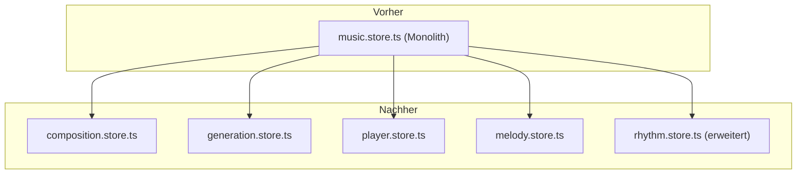

# Refactoring-Plan: Aufteilung des `music.store`

Dieser Plan beschreibt die Aufteilung des monolithischen `music.store.ts` in kleinere, logisch getrennte und wartbare Stores.

### Ziel

Die aktuelle Implementierung in `src/stores/music.store.ts` bündelt zu viele unterschiedliche Zuständigkeiten. Dies erschwert die Wartung und Weiterentwicklung. Ziel ist es, den Store nach Verantwortlichkeiten aufzuteilen (Single Responsibility Principle).

### Vorgeschlagene neue Store-Struktur

Die Funktionalität wird auf die folgenden neuen und erweiterten Stores verteilt:

1.  **`composition.store.ts` (Neu):** Verwaltet grundlegende musikalische Parameter.
2.  **`generation.store.ts` (Neu):** Beinhaltet Einstellungen für den Algorithmus zur Melodiegenerierung.
3.  **`player.store.ts` (Neu):** Kümmert sich um die Wiedergabe der Melodie.
4.  **`melody.store.ts` (Neu):** Zuständig für die generierte Melodie, den Generierungsprozess und MIDI-Funktionen.
5.  **`rhythm.store.ts` (Erweiterung):** Bündelt alle spezifischen Rhythmus-Parameter.

Der ursprüngliche `music.store.ts` wird nach dem Refactoring entfernt.

### Visuelle Darstellung

### Detaillierte Aufteilung der Zuständigkeiten

#### `composition.store.ts`
- **State**: `scaleName`, `key`, `bars`, `octave`
- **Actions**: `setScaleName`, `setKey`, `setBars`, `setOctave`

#### `generation.store.ts`
- **State**: `useMotifRepetition`, `motifRepetitionPattern`, `useRandomMotifPattern`, `useNGrams`, `nGramLength`, `startWithRootNote`, `restProbability`, `useMotifTrainingData`
- **Actions**: Entsprechende Setter für jeden State.

#### `player.store.ts`
- **State**: `isPlaying`, `loopPlayback`, `selectedInstrument`, `useFixedVelocity`, `fixedVelocity`, `bpm`
- **Actions**: Entsprechende Setter für jeden State.

#### `melody.store.ts`
- **State**: `melody`, `isGenerating`, `midiUrl`, `track`
- **Actions**: `generateMelody`, `generateMidiFile`, `downloadMidiFile`
- **Getters/Actions**: `getFileName`

#### `rhythm.store.ts` (Erweiterung)
- **State**: `rhythm`, `euclideanRotation`
- **Actions**: `setRhythm`, `setEuclideanRotation`