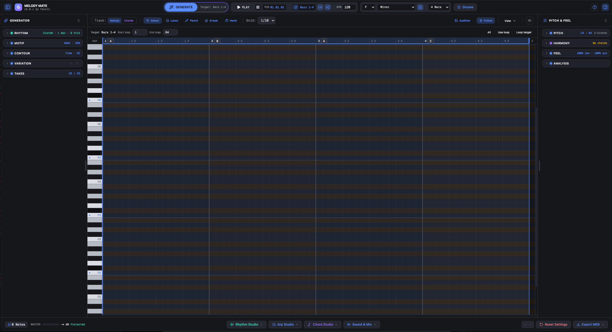
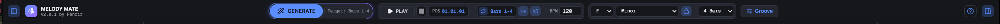
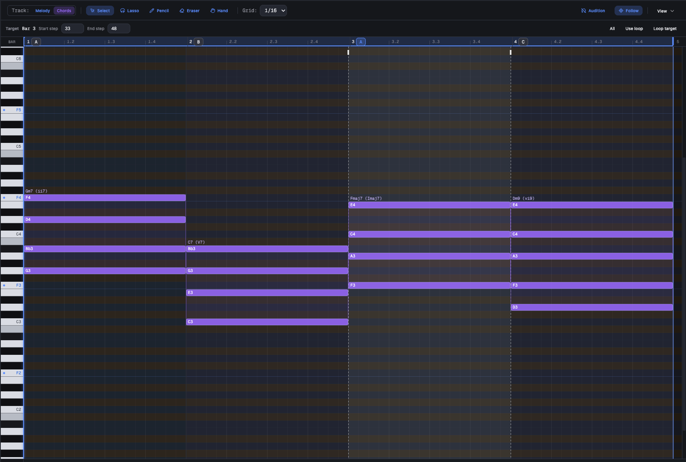
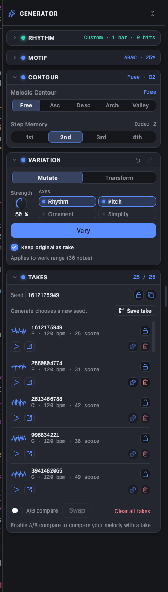
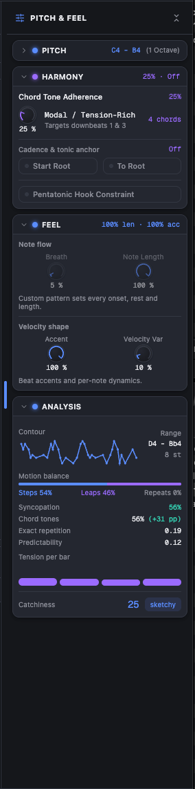
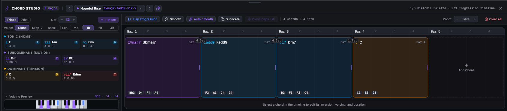
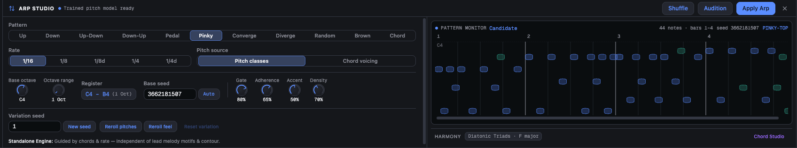
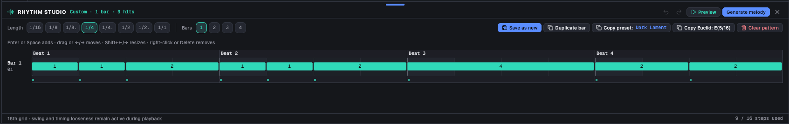
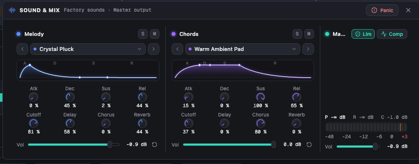

# Melody Mate v2 - User Guide & Reference Manual

Melody Mate v2 (DAW Edition) is an interactive generative MIDI workstation and melodic sketchpad designed for music producers, beatmakers, and composers. It runs entirely inside your browser, operating client-side with zero audio latency and complete offline capability.

Instead of relying on black-box AI prompts or chaotic randomizers, Melody Mate v2 combines deterministic mathematics, N-gram Markov models, Bjorklund Euclidean geometry, and classical voice leading heuristics. It functions as a responsive musical sparring partner: helping you discover catchy lead hooks, basslines, arpeggios, and chord progressions, edit them on an interactive canvas piano roll, audition them through onboard synthesizers, and export clean multi-track MIDI directly into your digital audio workstation (DAW).

<!-- Screenshot Placeholder: Full workspace view with piano roll, sidebars, and docks -->

> **Note on Supported Devices:** Melody Mate v2 is built exclusively for desktop and laptop environments (screen width ≥ 768px, recommended ≥ 1280px) to provide precision control over the piano roll, synthesizers, and multi-track timelines. Accessing the app on a smartphone automatically displays the **Mobile Gate** with a full visual preview and one-click options to copy or share the link to your computer.

---

## 1. Quickstart Workflow

Melody Mate v2 is designed to jumpstart your creative session in five straightforward steps:

### Step 1: Set Key, Scale, and Tempo

In the top transport bar, choose your project's root key (e.g. `C`), scale or mode (e.g. `Minor`), and tempo in BPM (e.g. `124`). Select the arrangement length (e.g. `4 Bars`). Everything generated across the workstation will conform strictly to this musical foundation.

### Step 2: Build a Chord Progression in Chord Studio (`C`)

Press `C` to open the Chord Studio dock. Select a genre preset (such as Pop, Electronic, or Jazz & Soul) or click chord cards in the Diatonic Palette to add triads or 7th chords to your timeline. Use the Auto-Smooth button to optimize voice leading so chord transitions flow naturally without jarring jumps.

### Step 3: Define a Work Range

By default, Melody Mate targets your entire arrangement. If you only want to generate or modify a specific section (such as Bar 2 to 3), click and drag along the piano roll ruler or enter step numbers in the Work Range bar. Any generation or variation you trigger will only affect the selected range, leaving the rest of your melody intact.

### Step 4: Generate a Melody (`G`) or Arpeggio (`A`)

Press `G` to generate a melody using the current settings in the left Generator panel. Alternatively, press `A` to open Arp Studio and create an arpeggiated line locked to your chord voicings. Review variations in the Take Rack, experiment with melodic contours, or nudge the Motif Variation fader to explore different phrasing styles.

For a fresh starting point, click **Surprise me** beside Generate. It first chooses a random key from all 12 root keys and a random scale from all 21 supported scales. It then selects a random chord progression and rhythm preset, randomizes the motif pattern, contour, Step Memory (orders 1–4), and Chord Tone Adherence (0–100%), and generates immediately. The chord progression is adapted to the chosen scale, including pentatonic and exotic scales. Breath stays within 0–25% and Note Length within 50–100%; percentages use 5% increments. It enables chord guidance, switches to rhythm presets and motif pattern mode, and turns off per-generation rhythm rerolling so the selected preset is the one used. Key and scale apply to the whole project; only chords and melody inside the current work range are replaced. Tempo, pitch bounds, sounds, and other generator settings stay as configured. Generate's seed-lock behavior and Take capture still apply. Melody and chord edits use their existing separate Undo histories; their Undo actions do not restore the project key or scale.

### Step 5: Audition, Route & Export Multi-Track MIDI

Press `Space` to listen to your idea. Press `S` to open the Sound & Mix rack to dial in synthesizer presets, filter cutoffs, and effect sends, or configure live Web MIDI output to stream lead and chord notes directly into external DAWs and hardware synths. Tweak Swing and Timing Looseness in the header to give your groove a human feel. Finally, click the Export button in the footer to download a clean `.mid` file and drag it into your DAW.

---

## 2. Transport Bar & Project Setup (Header)

The top header bar anchors the workstation. It hosts playback controls, arrangement length, musical tonality, tempo, and groove settings. It features progressive responsive adaptation across viewports from 769px up to ultrawide displays:

- **Desktop & Widescreen (>= 1280px):** Full brand title, expanded hero action label (`GENERATE`), tactile hardware transport with `Play`/`Stop` icons, numeric position display, loop cluster with transport options popover (`...`), key, scale, scale lock, bars, tempo, and groove icon button.
- **Laptops & Compact Viewports (768px – 1279px):** Brand collapses to the signature gradient icon (which opens the About dialog on click), hero generation pill adapts to compact icon tools (`Wand` and `Dice`), while all fundamental musical and transport controls (Key, Scale, Scale Lock, Bars, Tempo, Loop, Position) remain directly visible, unclipped, and fully interactive.

<!-- Screenshot Placeholder: Transport bar and project settings in header -->

### Playback & Transport Controls

- **Play / Pause (`Space`):** Starts or pauses transport playback. The playhead moves smoothly across the piano roll timeline in real time.
- **Stop & Return to Start (`Home` or `Shift+Space`):** Halts playback immediately and rewinds the playhead back to the loop start point or Bar 1.
- **Step Backward / Forward (`,` / `.`):** Seeks the playhead backward or forward by exactly one bar.
- **Position Timecode (`Bar.Beat.Step`):** Displays current transport position with sub-beat precision (e.g. `02.03.01` represents Bar 2, Beat 3, 16th-note step 1).

### Loop & Playhead Modes

- **Loop Toggle (`L`):** Activates continuous looping between the loop start and loop end markers.
- **Loop Note Gates:** Notes and chords release at the loop end even when their written duration extends beyond it. Instrument release and effect tails can continue to decay.
- **Loop Markers:** Draggable triangular flags located on the top ruler. Click and drag the left or right marker to position the playback loop region anywhere along the project grid.
- **Loop Selection (`Ctrl+L` / `Cmd+L`):** Snaps the loop region boundaries directly to the time span of all currently selected notes.
- **Play from Loop Start:** When enabled, pressing Play (`Space`) always restarts playback from the loop start marker rather than resuming from the paused location.
- **Return to Start on Pause:** When enabled, pausing playback automatically returns the playhead to the loop start or Bar 1.
- **Follow Playhead (`F`):** When active, the piano roll canvas automatically scrolls horizontally to keep the playhead visible during playback.

### Musical Tonality & Arrangement Length

- **Root Key:** Dropdown supporting all 12 chromatic pitches: `C`, `C#`, `D`, `Eb`, `E`, `F`, `F#`, `G`, `Ab`, `A`, `Bb`, `B`.
- **Scale / Mode Selection:** Select from 21 scales organized into 5 practical categories:
  - _Standard:_ Major (Ionian), Minor (Aeolian), Harmonic Minor, Melodic Minor.
  - _Modes of Major:_ Dorian, Phrygian, Lydian, Mixolydian, Locrian.
  - _Jazz & Blues:_ Bebop Major, Bebop Minor, Blues.
  - _Pentatonic:_ Major Pentatonic, Minor Pentatonic.
  - _Symmetric & Exotic:_ Whole Tone, Whole-Half Diminished, Half-Whole Diminished, Hungarian Minor, Phrygian Dominant, Double Harmonic Major, Ichikosucho.
- **Scale Lock (`K`):** When active, any note drawn with the pencil tool or dragged vertically is forced onto valid scale degrees. This prevents accidental out-of-key notes while allowing intentional chromatic movement when switched off.
- **Bar Count Selector:** Sets arrangement length to 1, 2, 4, 6, 8, 12, or 16 bars (default is 4 bars). Changing the bar count expands or contracts the project timeline without deleting existing notes.

### Tempo & Project Groove

- **BPM (Tempo):** Configurable from 40 to 280 BPM (default is 120 BPM). Click the numeric display to type an exact tempo value, or click the up/down arrows.
- Changing BPM rebuilds upcoming melody and chord events with the new note durations while keeping the short tempo ramp. Notes already sounding internally may finish with their original gate.
- **Tap Tempo:** Click repeatedly in rhythm to automatically calculate and set the BPM to match your tapped beat.
- **Swing Knob (0% to 100%):** Shifts offbeat 8th and 16th notes later in time, creating traditional MPC-style swing or shuffle feel. 0% is strictly straight; 50% to 70% produces natural swing.
- **Timing Looseness Knob (0% to 100%):** Injects subtle human micro-timing variations into note onsets. Small values (5% to 15%) eliminate robotic stiffness without dragging the groove.
- **Groove Preview Graphic:** A real-time SVG diagram showing straight grid positions versus swung and loosened note triggers.
- _Producer Tip on Groove:_ Swing and timing looseness apply to audio playback and are encoded into exported MIDI ticks, but notes remain visually locked to the piano roll grid for clean editing.

---

## 3. Interactive Canvas Piano Roll

The center of Melody Mate v2 is an interactive HTML5 2D canvas running at a steady 60 FPS. It supports full Retina and high-DPI displays with crisp rendering and zero DOM overhead.

<!-- Screenshot Placeholder: Piano Roll with active Work Range and Ghost Chords -->

### Editing Tools

Switch tools via number keys (`1` through `5`) or letters:

- **Select Tool (`1` or `V`):** The primary pointer tool.
  - Click a note to select it.
  - Hold `Shift` and click to add or remove notes from the selection.
  - Hold `Ctrl` or `Cmd` and drag across empty space to draw a rectangular selection box.
  - Click and drag notes to move them in time or pitch.
  - Drag the left or right edge of any selected note to resize its duration.
  - Drag empty grid space to set or adjust the Work Range.
- **Lasso Tool (`5`):** Click and drag a marquee box anywhere on the canvas to select multiple notes across bars and octaves without accidentally moving notes.
- **Pencil Tool (`2` or `P`):** Click empty grid cells to insert notes conforming to the active snap grid. Drag horizontally to draw sustained notes.
- **Eraser Tool (`3` or `E`):** Click individual notes to delete them immediately, or hold and sweep across multiple notes to erase them in a single gesture.
- **Hand / Pan Tool (`4` or `H`):** Click and drag anywhere across the canvas to pan smoothly through time and pitch registers without altering notes or selections.

### Dual-Track Editing (Melody vs Chords)

Toggle active editing between tracks using the toolbar buttons or by pressing `Tab`:

- **Melody Track (Signal Blue `#5b8dff`):** Displays lead notes. This track connects to the main Generator, Variation suite, and the bottom Velocity Lane.
- **Chord Track (Chord Purple `#9b6bff`):** Displays chord voicing notes. Switch to the Chord Track to edit individual notes inside chord blocks directly on the canvas grid.

### Visual Feedback & Guidance Layers

- **Scale Highlighting:** Valid scale rows are subtly illuminated, while non-scale chromatic rows are darkened. This provides an immediate visual guide for in-key note placement.
- **Ghost Chords:** When editing the Melody Track, active chord voicings appear as semi-transparent purple blocks directly behind the grid. You can visually target chord tones on downbeats and passing notes on offbeats.
- **Velocity Shading:** Note block opacity and outline intensity vary dynamically based on note velocity (1 to 127).
- **Note Playback Bloom:** When a note is actively sounding during playback, it illuminates with a soft ambient glow.
- **Sticky Left Keyboard:** Pinned piano keys along the left edge display pitch names (e.g. `C3`, `F#4`) and highlight under your cursor. Click any key to audition that pitch through the active track synthesizer.

### Grid Snapping

- **Snap Resolutions:** Select between `1/16` (sixteenth notes), `1/8` (eighth notes), `1/4` (quarter notes), triplet divisions (`1/16T`, `1/8T`, `1/4T`), or free unquantized mode.
- **Grid Shortcuts:** Press `[` or `Ctrl+1` / `Cmd+1` to make the snap grid finer; press `]` or `Ctrl+2` / `Cmd+2` to make the snap grid coarser.

### Targeted Generation with Work Ranges

Melody Mate v2 lets you isolate specific sections of your arrangement for targeted generation without touching notes outside the selection:

- **Work Range Controls Bar:** Displays current Start Step and End Step (1-based, bar/beat accurate, e.g. `Bar 2.1 - 3.4`).
- **Canvas Scrim:** The area outside the active work range is dimmed with a dark overlay, clearly indicating where generation will take place.
- **Direct Canvas Adjustment:**
  - Click and drag the top handle bar of the work range to move the entire block forward or backward in time.
  - Hover over the left or right border and drag the edge grip to expand or shrink the range.
  - Click outside the range in the ruler area to reset the work range to the full project.
- **Quick Range Presets:**
  - _All:_ Extends the work range across the entire project length.
  - _Use Loop:_ Snaps the work range to the current transport loop region.
  - _Loop Target:_ Adjusts the transport loop markers to match the active work range.
- _How Generation Respects the Range:_ Pressing Generate (`G`) or applying any Variation tool replaces or transforms notes only within the active work range. Notes before or after the range remain intact.

### Bottom Velocity Lane

- Toggle the lane with `Shift+V` or the footer button.
- Dedicated to the Melody Track, displaying vertical stems with circular drag pins from velocity 1 to 127.
- **Pin Editing:** Click and drag any pin vertically to adjust note dynamics. Audition feedback plays the note at the updated velocity level.
- **Multi-Selection Editing:** When multiple notes are selected in the piano roll, dragging one velocity pin scales all selected velocities proportionally.
- **Ramp Drawing:** Click and drag across the velocity lane to draw ascending or descending dynamic velocity ramps.

---

## 4. Generator Panel (Left Sidebar)

Press `B` to show or hide the left Generator panel. The panel width is resizable from 200px to 420px (default 280px). It houses all algorithmic generation modules, form patterns, mutations, and take management.

<!-- Screenshot Placeholder: Variation and Take Rack Modules -->

### Rhythm Module

Controls the rhythmic structure and placement of melody notes:

- **Preset Mode:** Choose from 100 rhythmic templates in three selection categories: _Melody_ (51), _Bass_ (33), and _World_ (16). Basic pulses and longer phrases are included in Melody and Bass.
  - _Dark electronic & synth styles:_ EBM Machine Pulse, EBM Body Drive, EBM Sequencer Lock, Dark Electro Interlock, Dark Electro Burst & Response, Dark Techno Chug, Dark Techno Three-Step Sequence, Industrial Stop-Start Bass, Coldwave Sparse Bass, Darkwave Longing Phrase, Darksynth Chase, and synthpop hooks and bass phrases.
  - _Other grooves:_ Disco Pickup Bass, Deep House Pocket, Garage Skipping Bass, Funk Rest Pocket, Hip-Hop Space Bass, Drum & Bass Push, Dub Answer Bass, House Piano Push, Trance Release Arp, Electro-Funk Hook, R&B Answer Phrase, and Indie Pop Lift.
  - _Space & phrasing:_ Ambient Breath, Cinematic Slow Build, Pop Two-Bar Release, Pickup Hook, Sustained Phrase, and Two-Bar Question & Answer complement straight eighths, sixteenths, and dotted figures.
  - _World:_ Tresillo, Cinquillo, Son and Rumba Clave in both 3:2 and 2:3 orientations, plus Bossa Nova, Samba, Maqsum, Habanera, and Afrobeat-, Highlife-, Soca-, Baião-, tango-milonga-, and dembow-inspired lines.
  - Patterns span one, two, or four 4/4 bars. Longer phrases repeat their complete cycle from project start; a partial work range keeps that phase and clips notes at its end. Open Rhythm Studio (`R`) and use **Copy preset** to inspect or adapt their entries and rests.
  - Style names suggest musical uses for a single melody or bass line. Presets set entries, durations, and rests; tempo, pitch, sound, accents, and project swing remain separate controls. For clipped electronic sequences, start with a short Note Length and low Breath / Rest Probability to preserve the written pulse.
  - Selecting a _Bass_ preset automatically uses the bass-trained Markov model for pitch transitions. _Melody_ and _World_ presets use the melody-trained model. Random preset selection chooses the matching model after picking the rhythm. Your octave range and sound settings remain under your control.
- **Random Preset Toggle:** Automatically selects a new rhythm preset on every generation run, encouraging rapid exploration of diverse rhythmic ideas.
- **Euclidean Mode (Bjorklund Algorithm):** Generates mathematically balanced rhythmic pulses:
  - _Pulses:_ Number of active hits distributed evenly across the measure.
  - _Steps:_ Total grid steps in the Euclidean cycle (typically 16).
  - _Rotation:_ Shifts the starting step of the pattern clockwise or counter-clockwise.
  - _Subdivision:_ Sets resolution to quarter (`4n`), eighth (`8n`), sixteenth (`16n`), or thirty-second (`32n`) notes.
  - _SVG Circular Visualizer:_ Live clock-face diagram rendering active triggers and rests.
- **Custom Mode:** Directly links the generator to your user-sequenced pattern from Rhythm Studio (`R`).
  - Custom and Euclidean rhythms use the melody-trained model, including when the last selected factory preset was a Bass preset. If the requested model is unavailable, generation uses its synthetic scale model.

### Motif Module

Controls thematic repetition and multi-bar form structures:

- **Motif Form Patterns:** Select how themes repeat across bars:
  - `FREE`: Unconstrained phrasing across the arrangement.
  - `AAAA`: The same thematic phrase repeats in every bar.
  - `ABAB`: Alternates between two distinct phrases (Theme A and Theme B).
  - `ABAC`: Theme A appears in bars 1 and 3, contrasting with unique themes in bars 2 and 4.
  - `AABA`: Classical 32-bar / pop song form (statement, repetition, departure, resolution).
  - `ABCB`: Theme B acts as a recurring hook anchored between contrasting sections.
- **Motif Section Badges:** Section markers (`A`, `B`, `C`) appear directly on the timeline ruler to visualize form boundaries.
- **Motif Variation Fader (0% to 100%):** Governs how far repeated motif sections drift from the opening theme:
  - At _0%_, repeated sections are exact copies of the initial phrase.
  - At _40% to 60%_, the rhythm remains recognizable while pitch intervals adapt smoothly to changing underlying chords.
  - At _100%_, repeated sections interpret the motif freely with improvisational flair.
- **Call & Response Mode:**
  - Splits phrases into an antecedent question (Call) and consequent answer (Response).
  - _Answer Styles:_
    - `Echo`: Repeats the call phrase with rhythmic or register displacement.
    - `Inversion`: Melodic mirror; upward leaps in the call become downward leaps in the response.
    - `Sequence`: Shifts the call line up or down by a diatonic scale step.
    - `Resolution`: Forces the response to resolve decisively onto the tonic note or chord root.
  - _Answer Variation Fader (0% to 100%):_ Controls how closely the response mirrors or varies the call.

### Contour Module

Shapes the trajectory and predictability of the melodic line:

- **Melodic Contours:**
  - `Free`: Organic, unguided melodic movement.
  - `Ascending`: Rising melodic line that builds tension toward a climactic high note.
  - `Descending`: Cascading downward line conveying relaxation and resolution.
  - `Arch`: Classical arc that ascends through the first half of the phrase and descends through the second.
  - `Valley`: Inverted arc that dips into lower registers before rising back to the starting register.
- **Contour Strength Fader (0% to 100%):** Controls how strictly generated pitches follow the selected geometric curve. Low values introduce exploratory deviations; high values hold strictly to the curve.
- **Step Memory / Markov Complexity (Orders 1, 2, 3, 4):**
  - _Order 1:_ Probability depends only on the single preceding note. Produces wider branching and surprising turns.
  - _Order 2 (Default):_ Probability considers the last two notes. Provides an optimal balance between catchy structure and melodic variety.
  - _Order 3 & 4:_ Probability looks back three or four notes. Generates structured, traditional phrases adhering closely to classical training patterns.

### Variation Module

Applies non-destructive transformations to existing melodies within the active work range:

- **Mutation Mode:**
  - _Mutation Strength Knob (0% to 100%):_ Sets the depth and probability of transformation.
  - _4 Independent Mutation Axes:_
    - `Rhythm`: Nudges note start times, splits steps, or adjusts durations while keeping pitches steady.
    - `Pitch`: Transposes notes by small scalar intervals while preserving the rhythmic groove.
    - `Ornament`: Injects neighboring tones, passing notes, and subtle embellishments.
    - `Simplify`: Prunes passing notes on weak beats and lengthens primary tones for a cleaner, more memorable hook.
  - _Keep Original as Take Toggle:_ When active, automatically archives the pre-mutation melody into the Take Rack before applying changes.
- **Transform Mode (Deterministic Operations):**
  - `Invert`: Melodic inversion across the horizontal center pitch axis.
  - `Reverse`: Retrograde transformation reversing the chronological sequence of notes.
  - `One Up` / `One Down`: Transposes all notes up or down by one diatonic scale step.
  - `Double` / `Halve`: Metric augmentation (doubles durations) or diminution (halves durations).
  - `Octave Up` / `Octave Down`: Shifts all notes by +/-12 semitones.
  - `Shift Forward` / `Shift Back`: Moves notes forward or backward by one snap grid step.

### Take Rack Module

Archives and organizes your generated melody iterations:

- **Take History (Up to 25 Takes):** Automatically saves generation runs into a FIFO queue.
- **Take Metadata:** Each entry displays a pitch contour sparkline, composite catchiness score badge, timestamp, seed number, and note count.
- **Lock Take:** Click the padlock icon to protect favorite takes from being overwritten when the queue reaches capacity.
- **Background Audition:** Click the speaker icon on any take to listen to it immediately without replacing your current piano roll notes.
- **One-Click Load:** Click any take to load it directly into the active piano roll editor.
- **Seed Reuse:** Recovers the exact PRNG seed from a past take and applies it back to the generator parameters.
- **A/B Comparison & Swap:** Select a take to toggle back and forth against your current melody, or click Swap to replace the active melody with the take.
- **Clear All:** Opens a confirmation modal that safely purges all unlocked takes while preserving locked favorites.

---

## 5. Pitch & Feel Panel (Right Sidebar)

Press `I` to show or hide the right Expression panel. The panel width is resizable from 200px to 420px (default 280px). It controls pitch boundaries, harmonic constraints, rhythmic feel, and real-time melody analysis.

<!-- Screenshot Placeholder: Melody Analysis and Expression Panel -->

### Pitch Module

- **Octave Bounds (C1 to B7):** Sets the lower (Min Octave) and upper (Max Octave) bounds for melody generation. The default is Octave 4 to 4 (`C4` to `B4`).
- **Octave Span Readout:** Displays the resulting vocal or instrumental register span in octaves and semitones.
- **Register Balance:** Melody weighting and contour planning use the exact center of the selected pitch bounds. For `C4` to `B5`, the center lies between `B4` and `C5`, giving both octaves room for melodic movement. Individual melodies can use a smaller part of the available range.
- _Producer Tip:_ Restricting generation to a single octave (e.g. `C4` to `B4`) produces tight, focused pop hooks, while setting a 2 or 3-octave span allows broader melodic movement.

### Harmony Module

- **Chord Tone Adherence Knob (0% to 100%):** Governs how strongly melody notes align with underlying chord tones:
  - At _100%_, notes landing on metric downbeats are locked to the root, third, fifth, or seventh of the active chord.
  - At _50% to 75%_, strong beats target chord tones while offbeats use diatonic passing notes.
  - At _0%_, the generator ignores chord tones and wanders freely across all notes of the active scale.
- **Start on Root Toggle:** Forces the initial note onto the key root nearest the center of the selected pitch bounds.
- **Resolve to Root Toggle:** Forces the final note onto the same central tonic, creating a strong sense of cadential completion within the selected pitch bounds.
- **Pentatonic Hook Constraint:** Constrains note selection strictly to the 5-note pentatonic scale derived from the active key. This guarantees immediate melodic catchiness and eliminates dissonant half-step clashes.

### Feel Module

- **Breath / Rest Probability Knob (0% to 100%):** Injects natural musical pauses between phrases. Features built-in consecutive-rest damping so melodies never drop out for extended measures. Default is 5%.
- **Note Length / Gate Knob (25% to 100%):** Adjusts note gate duration relative to step length:
  - _25% to 50%:_ Tight, staccato plucks with crisp separation.
  - _75% to 90%:_ Natural melodic phrasing with clean articulation.
  - _100%:_ Full legato sustained notes that connect seamlessly.
- **Beat Accent Strength Knob (0% to 100%):** Increases velocity on metric downbeats (beats 1 and 3 in 4/4 time). Enhances rhythmic drive and groove definition. Default is 100%.
- **Velocity Variation Knob (0% to 100%):** Introduces organic velocity humanization across individual notes. Subtle settings (10% to 20%) remove mechanical uniformity without compromising mix balance.

### Analysis Module

Calculates real-time music theory metrics on the active melody:

- **Pitch Range & Span:** Displays lowest pitch, highest pitch, and total semitone range (e.g. `D4 - G5`, 17 st).
- **Motion Balance:** A visual horizontal split bar illustrating the proportion of:
  - _Stepwise Motion:_ Diatonic seconds (smooth melodic flow).
  - _Melodic Leaps:_ Thirds, fourths, fifths, and larger intervals (adds drama and energy).
  - _Repeated Notes:_ Successive identical pitches (enhances rhythmic urgency and vocal phrasing).
- **Syncopation Ratio:** Percentage of notes placed on weak metric offbeats. High values indicate funk, jazz, or modern syncopated pop.
- **Chord Tone Alignment:** Percentage of notes that match active chord tones, with a delta indicator relative to your target adherence.
- **Repetition Score:** Measures thematic phrase recurrence across bars.
- **Rhythm Predictability:** Quantifies rhythmic regularity versus syncopated variety.
- **Tension Lane:** Bar-by-bar curve tracking melodic tension. Higher pitch registers and dissonant intervals elevate tension; stepwise descents toward the root release tension.
- **Catchiness Score (0 to 100):** A composite heuristic score evaluating balance between repetition and novelty, interval distribution, and harmonic alignment. Accompanied by descriptive badges:
  - `Hook` (90 to 100): Highly memorable, tightly structured pop hook.
  - `Strong` (75 to 89): Well-balanced, expressive melodic line.
  - `Balanced` (55 to 74): Versatile phrase with moderate variety.
  - `Complex` (below 55): Intricate, exploratory line suited for jazz or cinematic textures.

---

## 6. The Studio Docks

Melody Mate v2 features three creation studios plus Sound & Mix sharing one dock slot beneath the piano roll. Open them via shortcut keys (`C`, `A`, `R`, `S`) or footer buttons. Opening one replaces the previous dock. Use the top separator to resize vertically and the header Close action to close. Preferred heights restore on reload; short windows clamp the visible height to keep the piano roll usable.

### Chord Studio (`C`)

The harmonic engine of Melody Mate v2. Use it to construct progressions, audition voicings, and optimize voice leading.

<!-- Screenshot Placeholder: Chord Studio Dock with Diatonic Palette and Timeline -->

- **Dynamic Diatonic Palette:**
  - Automatically calculates all diatonic triads and 7th chords for any of the 21 scales.
  - Displays Roman numerals (e.g. `I`, `ii`, `IV`, `V7`, `vii°`), chord quality tags, and constituent note names.
  - _Audition:_ Click any chord card to hear it immediately through the accompaniment synthesizer.
  - _Insert Mode:_ Click or drag chord cards directly onto the timeline below.
- **Progression Presets:**
  - Instant access to categorized progressions:
    - _Pop:_ Classic four-chord progressions (`I - V - vi - IV`, `vi - IV - I - V`, `ii - V - I`).
    - _Electronic / EDM:_ Driving minor loops, modal progressions, and six rhythmic chord-stab presets.
    - _Jazz & Soul:_ Sophisticated extended progressions with secondary dominants and 7th chords.
    - _Rock:_ Modal power progressions and flat-seventh rock cadences.
    - _Dark:_ Minor, Phrygian, and Harmonic Minor progressions for cinematic or trap tracks.
  - Presets repeat their original phrase to fit the work range; a final partial phrase is clipped rather than stretched. Consecutive repeats of the same chord are condensed in the Roman-numeral summary; the timeline retains every attack.
  - _Chord stabs:_ Choose the **EDM** category for these four-bar patterns. Their attack count describes repeated chord hits, with one harmony per bar:

    | Preset                       | Hits per bar | Rhythm                                                      |
    | ---------------------------- | ------------ | ----------------------------------------------------------- |
    | Dub Techno Sparse Stabs      | 2            | Short offbeats with long rests for delay tails              |
    | Deep House Offbeat Stabs     | 4            | Ninth chords on each eighth-note offbeat                    |
    | Piano House Syncopated Stabs | 5            | Mixed eighth- and sixteenth-note lengths with anticipations |
    | UK Garage Skipping Stabs     | 6            | Skipping sixteenths; add project swing for shuffle          |
    | Future Bass Eighth Stabs     | 8            | Eighth-note attacks with sixteenth-note rests               |
    | Trance Sixteenth Stabs       | 16           | Continuous sixteenth-note retriggers                        |

  - Select **Dub Stab** or **Muted Pluck Chords** in Sound & Mix for a short envelope. A slow pad can blur these rhythms. The 16-hit pattern uses full sixteenth-note gates, so its separation comes from the sound's decay. Presets preserve deliberate leading, internal, and trailing rests; **Close Gaps** changes that articulation by extending chords into the rests. Chord adherence follows sounding chord events and falls back to the existing scale/root behavior during rests.
- **Interactive Chord Timeline:**
  - Visual chord blocks positioned along the bar ruler.
  - Drag blocks horizontally to reposition them along the timeline.
  - Drag the left or right edge of any block to resize its duration in quarter-bar increments (minimum 0.25 bars).
  - _Voice Leading Badges:_ Numbers displayed between adjacent chord blocks indicate the total semitone voice leading distance (e.g. `2 st`, `4 st`).
  - _Auto-Smooth Voice Leading:_ Click the Auto-Smooth button to automatically calculate the optimal inversion for every chord in your progression, minimizing jumping distance across transitions.
- **Chord Inspector:**
  - _Voicing Styles:_ Switch between `Close` (compact voicings), `Open` (spread voicings), and `Drop-2` (drops the second voice from the top down an octave for rich jazz warmth).
  - _Inversions:_ Select Root Position, 1st Inversion, 2nd Inversion, or 3rd Inversion.
  - _Register Shift:_ Transpose chord voicings up or down by octaves (default register is 3).
  - _Scale Transposition:_ Nudge selected chords diatonically up or down through scale degrees.

### Arp Studio (`A`)

Generates rhythmic and melodic arpeggiated lines locked to your active chord progression.

<!-- Screenshot Placeholder: Arp Studio Dock with Trajectory Visualizer -->

- **11 Arpeggio Patterns:**
  - `Up`: Ascending through chord tones from lowest to highest.
  - `Down`: Descending through chord tones from highest to lowest.
  - `UpDown`: Ascends then descends continuously.
  - `DownUp`: Descends then ascends continuously.
  - `Random`: Triggers chord tones in randomized order.
  - `Converge`: Outside-in movement (alternating between lowest and highest tones inward).
  - `Diverge`: Inside-out movement (starting at the center chord tone and expanding outward).
  - `Thumb Bass`: Alternates between the lowest bass root note and upper chord tones.
  - `Pinky Top`: Alternates between the highest melody note and lower chord tones.
  - `Brown`: Brownian random walk (semi-random drift that prioritizes stepwise neighbors).
  - `Chord Rhythm`: Plays full chord voicings in rhythmic pulses.
- **Arp Rate Selection:** Choose from standard subdivisions (`1/16`, `1/8`, `1/4`) and dotted polyrhythmic divisions (`1/8d`, `1/4d`).
- **Pitch Source Modes:**
  - _Pitch classes:_ Rebuilds pitch selection from the active chord's pitch classes within the specified octave window.
  - _Chord voicing:_ Uses the exact absolute pitches and inversions configured in Chord Studio, ensuring custom voicings are heard directly in the arpeggio.
- **Inversion Cycling (`Inv Cycle`, default off):** The switch is enabled only when chord progression is active and at least one chord is held for two bars or longer. Otherwise it is disabled and cycling is effectively off, while your saved preference is retained and becomes active again when the progression qualifies. When available, cycling rotates the chord inversion once per bar while the same harmony continues, including across sustained or adjacent identical chords. A harmonic change or gap resets the chord cycle. The engine also supports a bar-based cycle over generated diatonic triads when no chord events are active. Both pitch sources are supported; octave modes continue to select octave layers in pitch-class mode. Pools stay centered around their original register by whole-octave shifts; inverted notes can cross the displayed octave-window edges. Chord Studio events stay unchanged.
- **Sound Shaping Controls:**
  - _Base Octave & Octave Range:_ Set starting octave (1 to 6) and span (1 to 4 octaves) when using pitch classes. With a range above one octave, the octave mode separates octave travel from the note pattern.
  - _Arp Octave Mode:_ Use the compact control beside Octave Range to choose `Up` (default), `Down`, `Alternate`, or `Zigzag`. Up plays complete pattern cycles from the lowest octave level upward; Down plays them from the highest level downward. Alternate moves between octave levels like a pendulum without repeating either endpoint. With two octaves, Alternate produces the same sequence as Up; the Alternate tooltip explicitly explains this. Zigzag changes octave level on each sounding note while keeping the chord-note pattern independent. At an octave range of one, all four modes sound the same. The control is disabled when the range is one or when Chord voicing is selected, and your choice is retained while disabled. Chord-voicing pitch selection follows the absolute pitches configured in Chord Studio and ignores octave mode, including when it falls back to pitch classes.
  - _Gate Length (0% to 100%):_ Governs note sustain, from staccato ticks to legato runs.
  - _Chord Adherence (0% to 100%):_ Balances strict chord tones against diatonic passing notes.
  - _Downbeat Accent (0% to 100%):_ Boosts velocity on primary beat divisions.
  - _Note Density (0% to 100%):_ Controls how frequently notes trigger on active subdivision steps.
- **Workflow & Sidebar Integration:**
  - _Unified Generation (`G`):_ Pressing `G` while Arp Studio is open generates the arpeggio candidate directly into the melody track.
  - _Quick Shuffle (`Shift+G`):_ Pressing `Shift+G` instantly rolls a new arpeggio seed, enabling rapid browsing of rhythmic and melodic variations.
  - _Header Actions:_ Dedicated `Shuffle` button (with Shuffle/Refresh icon) and `Generate` button (with Sparkles icon).
  - _Sidebar Rhythm Module Sync:_ When Arp Studio is open, the left sidebar's Rhythm module dynamically shifts its title to **Arp Studio**, reflects the active pattern and rate in its badge, and displays a status card with a direct close button.
- **Targeted Variations:** Independent variation seed controls allow you to reroll pitches, reroll groove feel, or reset back to the base candidate.
- **Interactive Trajectory Visualizer:** Real-time canvas showing the melodic pitch trajectory and chord boundaries of the arpeggio candidate across the work range.
- **Seed Controls:** Dedicated seed locking and randomization for repeatable, deterministic arpeggio figures. Reusing the same seed with the same octave mode reproduces the same notes.

### Rhythm Studio (`R`)

A full 16th-note step sequencer for designing custom rhythmic foundations.

<!-- Screenshot Placeholder: Rhythm Studio Dock with Step Sequencer -->

- **Step Grid Sequencer:** Supports 1 to 4 bar arrangements (up to 64 steps at 16th-note resolution).
- **Complete Note Value Palette:** Click to select note lengths before placing them on the grid:
  - Whole Note (`1/1`, 16 steps)
  - Half Note (`1/2`, 8 steps) and Dotted Half Note (`1/2.`, 12 steps)
  - Quarter Note (`1/4`, 4 steps) and Dotted Quarter Note (`1/4.`, 6 steps)
  - Eighth Note (`1/8`, 2 steps) and Dotted Eighth Note (`1/8.`, 3 steps)
  - Sixteenth Note (`1/16`, 1 step) and Dotted Sixteenth Note (`1/16.`, 1.5 steps)
  - Rests: Insert musical silence across selected durations.
- **Multi-Step Note Ties:** Notes that span multiple grid steps are rendered with continuous tie indicators.
- **Preset Management:** Save custom rhythms directly to your browser storage with custom names and tags. Load saved patterns at any time to drive the main melody generator.
- **Preset Management:** Save custom rhythms directly to your browser storage with custom names and tags. Load saved patterns at any time to drive the main melody generator.

---

## 7. Sound & Mix Dock (`S`)

Press `S` or click Sound & Mix in the footer to open the resizable Sound & Mix workspace dock. Melody Mate v2 features an onboard hybrid audio engine: Tone.js schedules transport timing and FM synthesis, while native Web Audio API audio graphs deliver high-performance subtractive synthesis.

Sound & Mix replaces any open Rhythm, Arp, or Chord Studio in the slot beneath the piano roll. It preserves the active track and undo context, and its sound and mix values survive dock switches. Drag the top separator or use its arrow keys to resize; double-click resets the height. The preferred height and selected dock restore on reload. Close, `S`, or `Escape` returns focus to the footer trigger without stopping playback. If a preset popup or modal is open, `Escape` closes that first. On short windows the content scrolls and the dock height shrinks to preserve piano-roll space.

The dock provides two compact views toggled via the header switcher: **Sound & Mix** (internal synthesizer and mixer strips) and **MIDI Output** (external hardware and DAW routing workstation). The dock header also displays a live MIDI connection status indicator.

<!-- Screenshot Placeholder: Sound & Mix Rack with Channel Strips and Master Limiter -->

### Dual Channel Strips (Melody & Chords)

Independent mixer strips for the **Melody Track** and **Chord Track**:

- **Per-Track Routing Summary:** Shows current route destination (`Internal synth`, `MIDI · Port · Ch X`, or `Both · Port · Ch X`) with a direct link to the MIDI Output view. For tracks routed exclusively to external MIDI, a reminder clarifies that internal sound controls and volume faders do not affect external hardware output.
- **Solo (`S`) & Mute (`M`):** Isolate or silence individual tracks during playback.
- **Volume Fader:** Decibel-calibrated horizontal fader with numeric readout. Double-click or click the reset button to return instantly to unity gain (`0.0 dB`). Faders and audio FX only shape internal sound; no volume scaling or audio return exists over external MIDI.
- **Sound Preset Selector:** Choose from calibrated synthesizer patches:
  - _Subtractive Synthesis Bank:_
    - `Warm Analog Poly`: Rich, lush polyphonic synthesizer with dual detuned saw oscillators, 24dB warm lowpass filter, and stereo chorus. Ideal for chords and ambient backing.
    - `Wide Saw Lead`: Modern stereo supersaw lead with 4-voice unison detuning, punchy sub oscillator, and sharp attack. Perfect for EDM and pop hooks.
    - `Focused Punch Bass`: Monophonic bass with dedicated sub-bass oscillator and tight envelope dynamics. Stereo chorus is bypassed to guarantee mono low-end compatibility.
    - `Transient Kalimba Pluck`: Organic, percussive pluck with wooden attack transients and quick decay.
    - `Ethereal Motion Pad`: Slow-blooming atmospheric pad with gentle filter modulation.
  - _Tone Synthesizer Bank:_
    - `Soft Triangle Keys`: Pure, clean polyphonic keys.
    - `Triangle Comp`: Warm, balanced synth for chord comping.
    - `Analog Lead`: Resonant Moog-style vintage lead.
    - `Pluck Arp`: Short decay pluck with high filter resonance for arpeggios.
    - `80s Synthwave`: Classic dual-oscillator vintage synth lead.
    - `Warm Ambient Pad`: Soft, wide backdrop pad.
    - `Electric Piano / Rhodes`: Classic FM-style electric piano with delicate tremolo.
- **Live ADSR Envelope Canvas:** Visual graphic displaying Attack, Decay, Sustain, and Release curves in real time as parameters are adjusted.
- **8 Sound Shaping Micro-Knobs per Track:**
  - _Row 1 (Envelope):_
    - `Atk` (Attack): Envelope onset time (fast punch to slow swell).
    - `Dec` (Decay): Time taken to drop from peak to sustain level.
    - `Sus` (Sustain): Held volume level while note is active.
    - `Rel` (Release): Ring-out time after note release.
  - _Row 2 (Filter & FX Sends):_
    - `Cutoff`: Lowpass filter cutoff frequency in Hz.
    - `Delay`: Auxiliary send level to the tempo-synced stereo delay.
    - `Chorus`: Auxiliary send level to the stereo chorus effect.
    - `Reverb`: Auxiliary send level to the algorithmic reverb processor.

### Master Output Bus & Audio Protection

Melody Mate v2 incorporates studio-grade protection processing on the master stereo bus to safeguard your ears and monitor speakers:

- **Creative Bus Compressor:** Provides glue compression to bind lead melodies and chord accompaniments into a polished, cohesive mix.
- **AudioWorklet Lookahead Brickwall Peak Limiter:**
  - Runs in a dedicated real-time audio thread.
  - Features true lookahead peak detection to catch fast transients before they reach the output.
  - Enforces a strict ceiling, preventing digital clipping or speaker distortion even during dense polyphonic playback.
  - _Gain Reduction Meter:_ High-visibility dB readout showing real-time gain reduction (e.g. `-1.8 dB`).
- **AudioWorklet Stereo Peak & RMS Meter:**
  - Dual vertical bar meters displaying instantaneous Peak and average RMS levels.
  - Peak-hold indicators and high-contrast red clip warning LEDs.
  - Tabular numeric decibel readouts (`dBFS`).
- **Sample Sanitization:** Real-time DSP sanitization replaces non-finite floating-point samples (`NaN` or `Infinity`) with silence, preventing audio engine crashes.
- **Glitch-Resistant Audio Buffer & Interface Protection:** Melody Mate automatically standardizes on $\le 48\text{ kHz}$ audio processing with balanced buffer sizing (`latencyHint: 'balanced'`) and 100 ms scheduling lookahead. When connecting studio audio interfaces configured to 96 kHz or 192 kHz, or when running under Windows 11 WASAPI shared mode, the audio engine prevents buffer underruns, pops/crackles, and audio stream dropouts while maintaining sample-accurate playhead tracking and responsive note auditioning.
- **Global Panic Button:** Always available in the footer, even with Sound & Mix closed. Panic silences internal voices and clears effect tails. For enabled MIDI routes it also clears app-owned port queues, releases known notes, and sends sustain-off, All Notes Off and All Sound Off on channels the app has used. Use it to stop unwanted sustained sound immediately. On narrow laptops Reset Settings and Export MIDI use icon buttons with the same accessible names and tooltips; Panic keeps its text label.

---

## 8. Multi-Track MIDI Export & DAW Integration

Live MIDI access, clock conversion, cancellable port queues and the shared Internal/MIDI/Both transport router are fully exposed through the **MIDI Output** view in the Sound & Mix workspace dock (`S`), labeled as **(experimental)** (verified with macOS and Ableton Live). Designed as a professional DAW workstation surface, Melody and Chords routing cards are positioned side-by-side in a dual-column layout mirroring the mixer strips. When enabling MIDI in the dock, the output destination automatically defaults to **MIDI** and assigns the first available MIDI output device (with channels 1 and 2 for Lead and Chords respectively), so transmission is immediately active without manual per-track configuration. Disabling MIDI reverts track destinations to Internal synthesizer playback. You can select output modes (`Internal`, `MIDI`, `Both`), choose target ports, assign MIDI channels (1–16), fine-tune timing offsets (-50 to +50 ms with `DawKnob`), monitor live note transmissions with hardware-style **TX Activity LEDs**, test note connections with a single click, trigger instant **Panic (All Notes Off)** to clear hung notes, and toggle `Send previews to MIDI`. Preview fan-out is off by default for each track. Internal note, chord, take, arpeggio-candidate and progression previews always remain available; enabling preview fan-out adds external notes on the corresponding Lead or Chords route through the shared MIDI queue. Changing the setting on applies to the next audition, while changing it off cancels that track's active external preview. MIDI permission is never requested on startup or dock opening, and internal playback and MIDI file export remain independent of device access.

The project audio snapshot saves each track's desired output mode, port ID and display hints, channel, timing offset and preview preference together with sound and mix settings. Reload restores these preferences with MIDI disabled and ports closed; sending requires explicit MIDI activation and a new Play/resume or audition action. A missing port stays unresolved, even if another device has the same name or manufacturer. Route edits count as unsaved audio changes until the paired project save succeeds; enabling MIDI, discovering devices and hotplug do not. Reset Settings releases external notes before restoring the central routing defaults. Older audio snapshot versions are discarded without migration. Live routes are not included in sound presets, takes or MIDI file exports.

External previews and the bounded test note are available only while transport is stopped or paused. They are blocked while playback is active or starting, so a preview Note-Off cannot cut off a transport note sharing the same pitch and channel. The test note has an explicit send action and cleanup; a successful send means the browser submitted MIDI data, not that a device acknowledged or produced it. Rhythm Studio clicks remain internal and are not routed to MIDI. These runtime operations do not add preview activity to project content, undo history or takes.

Enabled external notes are released on Stop, Pause, Seek, loop changes, Clear and project Reset/Load. Track mute, solo exclusion and Harmony mute release only affected tracks. Editing or muting one melody note releases its stable note ID while unchanged sounding melody notes and the other track keep their scheduled Offs. Replace/Generate, BPM and groove changes end affected external generations and rebuild future events; currently sounding internal notes keep their established release policy. A BPM change gives new Both notes the same new duration in both outputs. Seek does not chase missed melody notes; the existing active-chord pickup remains available after chord updates.

A route, channel or offset change replaces the old target only after preparation succeeds. MIDI Disable, pagehide, AudioContext suspension and clock timing loss cancel future external attacks. Device loss stops further sends; reconnect performs best-effort cleanup of known notes before an explicit Play/resume permits new output. Interrupted notes are never replayed. Normal edits and track cancellations send targeted Note-Offs; channel-wide safety controllers are reserved for global Panic.

The clock bridge streams Note-On, Note-Off, and Velocity events according to the project's internal transport timeline. It does not transmit MIDI Clock or automatically slave-synchronize a DAW transport; DAW recording is triggered manually at matching project BPM. Complete setup instructions for all platforms are available in the [MIDI Output & DAW Integration Guide](MIDI_OUTPUT.md), and physical acceptance test results are cataloged in the [Release Validation Report](MIDI_OUTPUT_VALIDATION.md).

Browsers without `MIDIOutput.clear()`, including Chromium-based browsers such as Brave, Chrome and Edge, are supported. Future events stay in Melody Mate until they are due, so Stop, Mute and route changes can cancel them safely. Output timing follows the 10 ms queue pump and may vary with browser scheduling load; ports with `clear()` retain timestamped lookahead scheduling. Test note uses the same capability-aware queue and always has an explicit release.

Initial availability of the browser's output timestamp and temporary missing timestamp samples do not stop MIDI playback. Once calibrated, the clock bridge retains its timing reference while the audio and performance clocks advance normally. Actual AudioContext suspension or clock discontinuities still release external notes and require a fresh Play/resume.

### Quick DAW Integration Setup

- **macOS IAC Driver:** Enable the IAC Driver in macOS **Audio MIDI Setup** (`Window` → `Show MIDI Studio` → double-click `IAC Driver` → check `Device is online`). In Melody Mate, click **Enable MIDI** and select `IAC Driver Bus 1`.
- **Ableton Live 12:** Open **Settings** → **Link, Tempo & MIDI** → locate `Input: IAC Driver (Bus 1)` in the MIDI Ports table. Turn **ON** the **Track** button (`Sync` and `Remote` remain OFF). On a MIDI track, set `MIDI From` to `IAC Driver (Bus 1)`, choose the channel (`1` for Lead, `2` for Chords), set `Monitor` to **In** (or **Auto** with Record Arm), and load a virtual instrument.
- **Apple Logic Pro:** Under Logic Settings → MIDI → Inputs, verify `IAC Driver Bus 1` (or `Logic Pro Virtual In`) is enabled. Create an Instrument track, set its MIDI input to the IAC bus and channel, and engage Input Monitoring.
- **Cockos REAPER:** Under Preferences → Audio → MIDI Devices, right-click the virtual port and select `Enable input`. On a track, set input to `Input: MIDI` → port → channel, and enable Record Monitoring.
- **Windows (loopMIDI):** Windows does not provide a default userland loopback driver. Install Tobias Erichsen's standard [loopMIDI](https://www.tobias-erichsen.de/software/loopmidi.html), create a loopback port, and select it in Chrome/Edge and your Windows DAW.
- **Hardware Synthesizers:** Plug in your class-compliant USB synth or MIDI interface. Click **Refresh ports**, choose the device, assign the channel matching your synthesizer, and set the track mode to **MIDI** (external only) or **Both** (layering). Use the **Offset** knob (-50 ms to +50 ms) to fine-tune hardware response against internal audio.
- **Emergency Panic:** In case of hung notes on external hardware due to an unplugged cable, press the global **Panic** button in the persistent footer (or press `Esc`) to immediately purge all queues, release sounding notes, and broadcast All Notes Off (`CC 123`) and All Sound Off (`CC 120`).

Click the **Export MIDI** button in the footer to open the export popover. Melody Mate v2 produces standard Type 1 MIDI files (`.mid`) formatted for direct import into any professional DAW or hardware sequencer.

### Export Modes

- **Lead Melody (.mid):** Exports only the melody track on MIDI Channel 1.
- **Chords (.mid):** Exports only the accompaniment chord voicings on MIDI Channel 2.
- **Multi-Track MIDI (.mid):** Combines both tracks into a single Standard MIDI File containing Lead on Channel 1 and Chords on Channel 2.

### Embedded Meta-Events & Groove Preservation

Every exported MIDI file contains industry-standard meta-events:

- **Key Signature:** Encoded from your project root and scale (e.g. `C Minor`, `G Major`).
- **Time Signature:** Formatted as `4/4`.
- **Set Tempo:** Encodes your exact project BPM.
- **Groove Preservation:** Active Swing and Timing Looseness settings are rendered directly into MIDI tick positions. Notes play back with human feel while remaining aligned to your DAW's beat grid.
- **Descriptive Filenames:** Files are automatically named with complete session metadata:
  `MelodyMate_<Key><Scale>_<BPM>BPM_<Bars>bar_<Type>.mid`
  _(Example: `MelodyMate_Cmin_124BPM_4bar_MultiTrack.mid`)_

### Step-by-Step DAW Import Guide

#### Ableton Live

1. Open Ableton Live and set your project tempo to match your Melody Mate export (or let Ableton adapt to the embedded tempo).
2. Drag the exported `.mid` file from your file manager directly onto an empty MIDI track in Session or Arrangement view.
3. If importing a Multi-Track file, drop it onto the track header area. Ableton Live will automatically create two separate tracks: Track 1 for the Lead melody and Track 2 for the Chords.
4. Drop your preferred VST instrument or Ableton instrument rack (such as Wavetable, Drift, or Piano) onto each track.

#### FL Studio

1. Drag the exported `.mid` file into the FL Studio Channel Rack or Playlist.
2. In the **MIDI Import Options** dialog that appears:
   - Check **Realign events**.
   - Check **Import time signature**.
   - Select **Split by channel**.
3. FL Studio creates separate Channel Rack slots for Channel 1 (Lead) and Channel 2 (Chords). Assign each channel to your desired generator plugin (such as FLEX, Vital, or Sytrus).

#### Logic Pro

1. Drag the exported `.mid` file into the Logic Pro Tracks area.
2. Logic will detect multi-track information and prompt: _"Do you want to import tempo information?"_ Click **Import**.
3. Logic automatically creates two software instrument tracks corresponding to the Lead and Chord channels.
4. Assign instruments from the Library or insert third-party plugins.

#### PreSonus Studio One

1. Drag the `.mid` file from your desktop directly into the Studio One Arrange window.
2. Studio One unpacks the file into separate instrument tracks for Lead and Chords.
3. Drag your chosen virtual instrument presets onto each track to begin mixing.

#### Cockos Reaper

1. Drag the `.mid` file into Reaper's track area.
2. When prompted: _"Expand 2 MIDI tracks to separate tracks?"_, click **Yes**.
3. Reaper creates two independent tracks with note data and CC automation intact.

---

## 9. Complete Keyboard Shortcuts Reference

Melody Mate v2 is built for fast desktop and laptop operation. All major functions can be controlled from your keyboard:

### Transport Shortcuts

| Key                | Action                 | Description                                                  |
| :----------------- | :--------------------- | :----------------------------------------------------------- |
| `Space`            | Play / Pause           | Start or pause transport playback                            |
| `Shift+Space`      | Stop & Rewind          | Stop playback and seek playhead to loop start or Bar 1       |
| `Home`             | Return to Start        | Rewind playhead to loop start or Bar 1 without stopping      |
| `L`                | Toggle Loop            | Enable or disable continuous transport looping               |
| `Ctrl+L` / `Cmd+L` | Loop Selection         | Snap transport loop region directly to selected notes        |
| `F`                | Toggle Follow Playhead | Enable or disable automatic canvas scrolling during playback |
| `,` or `<`         | Previous Bar           | Move playhead backward by one full bar                       |
| `.` or `>`         | Next Bar               | Move playhead forward by one full bar                        |

### Tools Shortcuts

| Key                       | Action          | Description                                              |
| :------------------------ | :-------------- | :------------------------------------------------------- |
| `1` or `V`                | Select Tool     | Switch to pointer, note move/resize, and work range tool |
| `5`                       | Lasso Tool      | Switch to marquee box selection tool                     |
| `2` or `P`                | Pencil Tool     | Switch to note drawing tool                              |
| `3` or `E`                | Eraser Tool     | Switch to note eraser tool                               |
| `4` or `H`                | Hand / Pan Tool | Switch to canvas pan tool                                |
| `[` or `Ctrl+1` / `Cmd+1` | Finer Grid      | Increase grid snap resolution (e.g. 1/8 to 1/16)         |
| `]` or `Ctrl+2` / `Cmd+2` | Coarser Grid    | Decrease grid snap resolution (e.g. 1/16 to 1/8)         |

### Editing Shortcuts

| Key                       | Action                  | Description                                               |
| :------------------------ | :---------------------- | :-------------------------------------------------------- |
| `Ctrl+Z` / `Cmd+Z`        | Undo                    | Undo last edit action on active track                     |
| `Ctrl+Shift+Z` / `Ctrl+Y` | Redo                    | Redo previously undone action                             |
| `Ctrl+A` / `Cmd+A`        | Select All              | Select all notes on the active track                      |
| `Escape`                  | Deselect All            | Clear note selection or close active popovers and docks   |
| `Ctrl+D` / `Cmd+D` / `D`  | Duplicate               | Duplicate selected notes immediately following selection  |
| `Backspace` / `Delete`    | Delete Selection        | Remove selected notes or chords                           |
| `↑` / `↓`                 | Transpose (±1 Semitone) | Transpose selected notes up or down by one semitone       |
| `Shift+↑` / `Shift+↓`     | Transpose (±1 Octave)   | Transpose selected notes up or down by 12 semitones       |
| `←` / `→`                 | Select Previous / Next  | Navigate selection to chronologically adjacent note       |
| `Shift+←` / `Shift+→`     | Nudge Notes             | Move selected notes left or right by the active snap grid |
| `Alt+←` / `Alt+→`         | Adjust Duration         | Shorten or lengthen selected notes by active snap step    |
| `Alt+↑` / `Alt+↓`         | Adjust Velocity         | Increase or decrease selected notes velocity by ±5        |
| `0`                       | Toggle Mute Selection   | Mute or unmute selected notes from audio playback         |

### Track & Sound Shortcuts

| Key       | Action              | Description                                                                        |
| :-------- | :------------------ | :--------------------------------------------------------------------------------- |
| `Tab`     | Switch Active Track | Toggle piano roll editing between Melody and Chord tracks                          |
| `G`       | Generate            | Trigger melody generation (or generate arpeggio candidate when Arp Studio is open) |
| `Shift+G` | Shuffle Arpeggio    | Roll a new arpeggio candidate seed while Arp Studio is open                        |
| `K`       | Toggle Scale Lock   | Lock note entry and dragging to active scale degrees                               |
| `U`       | Toggle Audition     | Enable or disable acoustic note preview while editing                              |

### Studio Docks & Panels Shortcuts

| Key       | Action                  | Description                                  |
| :-------- | :---------------------- | :------------------------------------------- |
| `B`       | Toggle Generator Panel  | Show or hide the left Generator sidebar      |
| `I`       | Toggle Expression Panel | Show or hide the right Expression sidebar    |
| `Shift+V` | Toggle Velocity Lane    | Show or hide the bottom velocity editor lane |
| `R`       | Toggle Rhythm Studio    | Open or close the Rhythm Studio dock         |
| `A`       | Toggle Arp Studio       | Open or close the Arp Studio dock            |
| `C`       | Toggle Chord Studio     | Open or close the Chord Studio dock          |
| `S`       | Toggle Sound & Mix      | Open or close the Sound & Mix workspace dock |
| `?`       | Keyboard Shortcuts Help | Display global keyboard shortcuts modal      |

### Viewport & Zoom Shortcuts

| Key                                   | Action           | Description                                                  |
| :------------------------------------ | :--------------- | :----------------------------------------------------------- |
| `+` / `-` or `Alt+Wheel`              | Horizontal Zoom  | Zoom in or out horizontally along the time axis              |
| `Shift++` / `Shift+-` or `Ctrl+Wheel` | Vertical Zoom    | Zoom in or out vertically across pitch rows                  |
| `Z`                                   | Fit Loop to View | Center and scale viewport to fit the active loop region      |
| `Shift+Z`                             | Fit Pitch Height | Adjust vertical row height to fit all active notes on screen |
| `0` or `Ctrl+0` / `Cmd+0`             | Reset Zoom       | Return horizontal and vertical zoom to factory defaults      |
